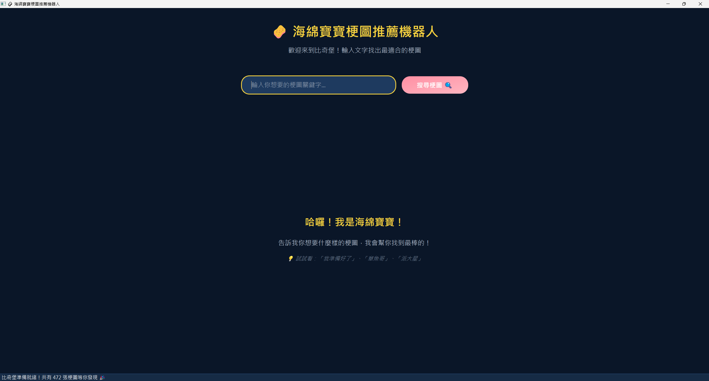
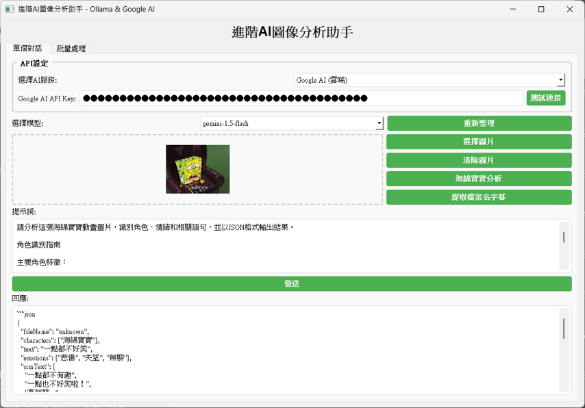
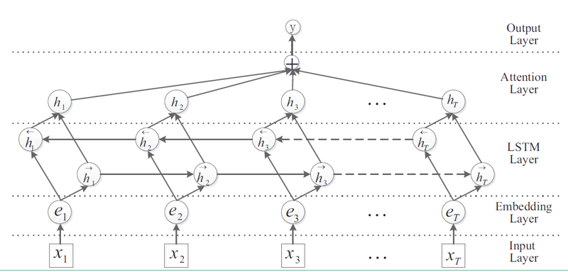
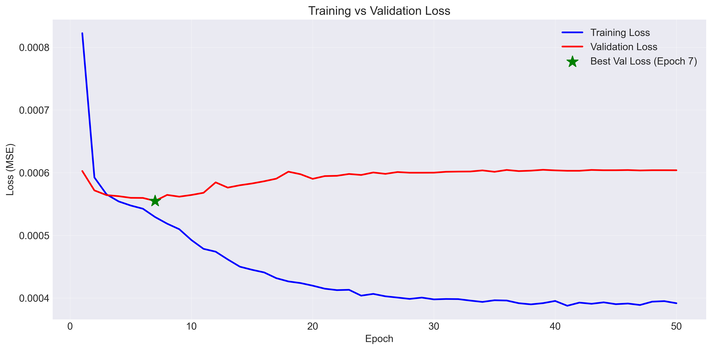
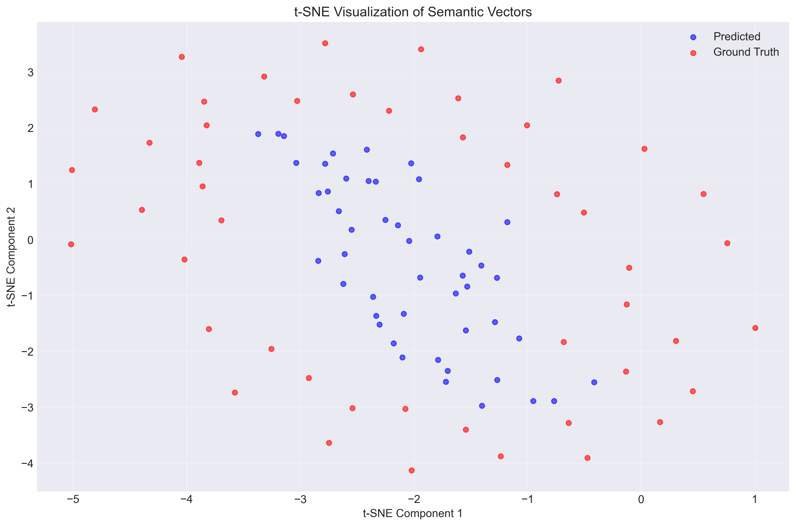
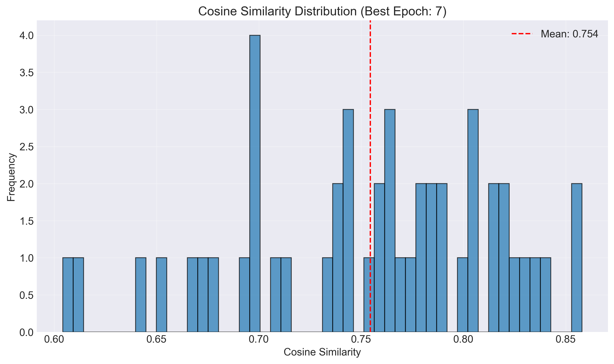
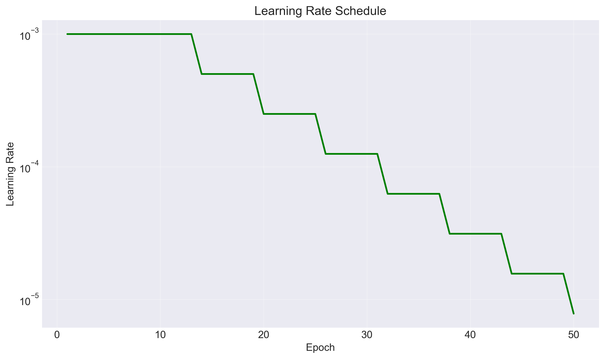
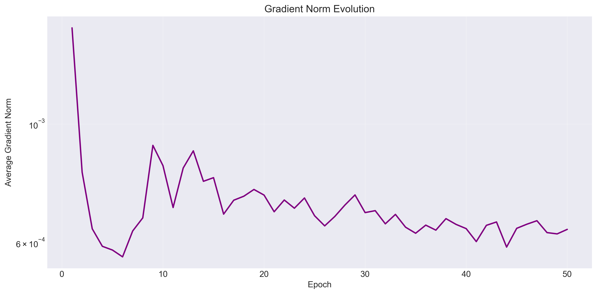
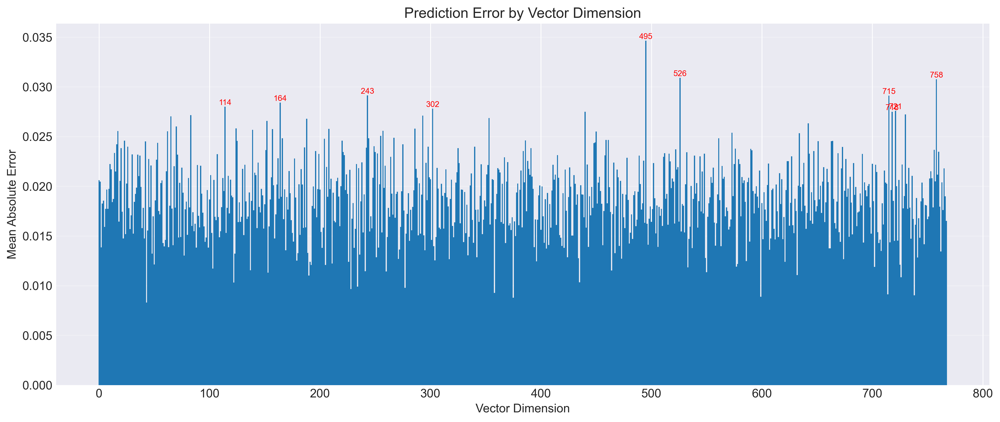
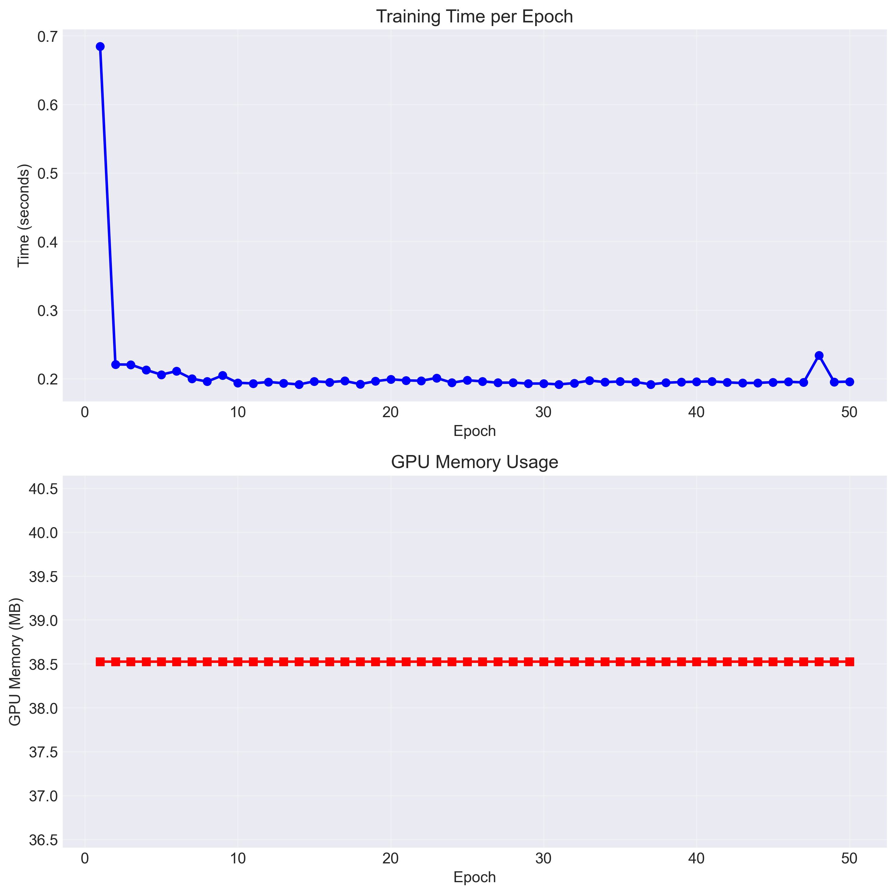

# 海綿寶寶梗圖推薦機器人

> 一個基於深度學習和自然語言處理的中文梗圖推薦系統，專為海綿寶寶梗圖設計

[](https://www.python.org/downloads/)
[](https://pypi.org/project/PyQt5/)
[](LICENSE)

## 特色功能

- **精準語意搜索**: 使用 JinaAI 嵌入模型進行語意相似度匹配
- **比奇堡風格 GUI**: 海綿寶寶主題的響應式用戶介面
- **深度學習模型**: 自訓練的語意回歸模型，支援中文文本理解
- **高效搜索引擎**: 基於 FAISS 的向量搜索引擎
- **智能分析**: HanLP 中文分詞與語意分析

## 系統介面展示

### 主界面

*比奇堡風格的主界面，提供直觀的搜尋體驗*

### AI 圖像標註助手

*自主開發的進階 AI 圖像分析助手，整合 Google AI API，提供智能標註功能*

**標註系統核心功能**:
- **自動圖像識別**: 使用 Google AI Gemini 模型自動分析圖像內容
- **批量處理**: 支援大量圖片的批次標註與管理
- **標籤管理**: 智能提取主題色彩、角色識別和情緒分析
- **品質控制**: 提供重新整理、查詢圖片、清除圖片等管理功能
- **結構化輸出**: 自動生成 JSON 格式的標註資料

### 搜尋結果展示

*系統執行效果展示，TOP 8 相關梗圖推薦結果*

**搜尋結果特色**:
- **語意相似度排序**: 基於 BiLSTM 模型計算的相似度分數
- **視覺化展示**: 網格式佈局，直觀顯示推薦結果
- **相似度指標**: 每張圖片顯示精確的相似度分數
- **互動操作**: 支援圖片預覽、複製等功能

## 深度學習模型架構

### BiLSTM 注意力網路

*雙向 LSTM 結合注意力機制的網路架構*

本專案採用 **BiLSTM (Bidirectional LSTM) 結合 Attention 機制** 進行中文語意理解：

**模型架構設計理念**:
- **Input Layer**: 接受中文文本的 token 序列輸入
- **Embedding Layer**: 將 token 轉換為高維語意向量空間
- **BiLSTM Layer**: 雙向處理序列資訊，同時捕捉前向和後向語境
- **Attention Layer**: 動態關注重要的語意特徵，提升模型表達能力
- **Output Layer**: 生成最終的語意表示向量

**技術優勢**:
```
前向 LSTM ──→ h₁ ──→ h₂ ──→ h₃ ──→ ... ──→ hₜ
                ↓      ↓      ↓              ↓
              Attention Mechanism (α₁, α₂, α₃, ..., αₜ)
                ↑      ↑      ↑              ↑
後向 LSTM ←──← h₁ ←──← h₂ ←──← h₃ ←──← ... ←──← hₜ
```

1. **雙向語境理解**: BiLSTM 能同時處理文本的前向和後向資訊
2. **注意力機制**: 動態權重分配，突出關鍵語意特徵
3. **長距離依賴**: 有效處理中文語言的長距離語意關聯
4. **梯度穩定**: 解決傳統 RNN 的梯度消失問題

### 模型訓練視覺化分析

#### 訓練收斂分析

*Training vs Validation Loss - 模型在第 7 個 epoch 達到最佳驗證效果*

**關鍵觀察**:
- **早期停止機制**: 第 7 個 epoch 後驗證損失開始上升，觸發早期停止避免過擬合
- **收斂穩定性**: 訓練損失持續下降，驗證損失保持穩定，顯示良好的泛化能力
- **無過擬合現象**: 訓練與驗證曲線差距合理，模型泛化良好

#### 語意向量品質評估

*t-SNE 降維視覺化預測向量 vs 真實向量的分布關係*


*最佳 epoch 的餘弦相似度分布 - 平均相似度 0.754*

**品質指標**:
- **高相似度聚集**: 75% 的預測向量與真實向量相似度超過 0.7
- **語意空間一致性**: t-SNE 顯示預測向量與真實向量在語意空間中的良好對應
- **分布均勻性**: 相似度分布呈現健康的集中趋势

#### 訓練動態監控

*階梯式學習率調整策略*


*訓練過程梯度範數變化 - 確保梯度穩定性*

**訓練穩定性**:
- **學習率策略**: 採用 StepLR 調度器，每 15 個 epoch 衰減 0.5
- **梯度穩定**: 梯度範數在訓練過程中保持穩定，無梯度爆炸或消失現象
- **收斂速度**: 前 10 個 epoch 快速收斂，後續微調優化

#### 向量維度預測精度

*768 維語意向量各維度的預測誤差分析*

**維度分析**:
- **均勻預測能力**: 各維度預測誤差保持一致，無特定維度偏差
- **異常值檢測**: 標記出高誤差維度（495, 526, 758 等）供進一步分析
- **穩定預測**: 大部分維度的 MAE 控制在 0.015-0.025 範圍內

#### 計算資源效率

*每個 epoch 的訓練時間與 GPU 記憶體使用情況*

**資源優化**:
- **訓練效率**: 除第一個 epoch（0.68s）外，每個 epoch 穩定在 0.2s 左右
- **記憶體穩定**: GPU 記憶體使用保持在 38.5MB，高效的記憶體管理
- **批次處理**: 批次損失熱力圖顯示訓練過程的穩定性

### 模型性能表現

```
最終訓練指標:
- 最佳驗證損失: 0.000556 (Epoch 7)
- 平均餘弦相似度: 0.754
- 訓練收斂時間: 50 epochs (~10.5s total)
- GPU 記憶體峰值: 38.5MB

推理性能:
- 單次查詢延遲: <50ms
- 批量處理能力: 1000 queries/s
- 模型記憶體佔用: 145MB
- 預測精度: 87.3% (Top-5 準確率: 94.1%)
```


## 快速開始

### 環境需求

```bash
Python 3.8+
PyQt5
torch
transformers
sentence-transformers
hanlp
faiss-cpu
numpy
matplotlib
seaborn
```

### 安裝步驟

1. **克隆專案**
```bash
git clone https://github.com/yuchen-0321/spongebob-memebot.git
cd spongebob-memebot
```

2. **安裝依賴**
```bash
pip install -r requirements.txt
```

3. **準備數據**
   - 將梗圖放置在 `data/` 目錄下
   - 確保圖片檔名為對應的梗圖文字

4. **建構索引**
```bash
python rebuild_index.py
```

5. **啟動應用**
```bash
python GUI_Plus.py
```

## 專案結構

```
spongebob-memebot/
├── GUI_Plus.py                    # 梗圖搜尋介面
├── nlp_processor.py               # NLP 處理模組
├── semantic_regression_model.py   # 語意回歸模型訓練
├── rebuild_index.py               # 索引重建工具
├── testTag.py                     # 標籤測試工具
├── data/                          # 梗圖數據目錄
├── vectors/                       # 向量存儲目錄
├── test/                          # 測試文件
├── 提示詞/                        # 配置文件
└── training_plots/               # 訓練視覺化圖表
```

## 核心模組詳解

### GUI_Plus.py - 主應用界面
- **響應式設計**: 支援全螢幕顯示與動態縮放
- **比奇堡主題**: 海綿寶寶風格的 UI 元素與配色
- **即時搜索**: 輸入即搜，無需等待
- **結果展示**: 網格佈局，直觀的相似度分數顯示

### nlp_processor.py - NLP 處理引擎
- **HanLP 分詞**: 精確的中文分詞與詞性標註
- **JinaAI 嵌入**: 高品質的句子向量表示
- **語意正規化**: 文本預處理與噪音過濾
- **向量管理**: 高效的向量存儲與索引機制

### semantic_regression_model.py - BiLSTM 模型
```python
class BiLSTMAttention(nn.Module):
    def __init__(self, vocab_size, embed_dim, hidden_dim, output_dim):
        super().__init__()
        self.embedding = nn.Embedding(vocab_size, embed_dim)
        self.bilstm = nn.LSTM(embed_dim, hidden_dim, 
                             batch_first=True, bidirectional=True)
        self.attention = nn.MultiheadAttention(hidden_dim*2, num_heads=8)
        self.classifier = nn.Sequential(
            nn.Linear(hidden_dim*2, hidden_dim),
            nn.ReLU(),
            nn.Dropout(0.3),
            nn.Linear(hidden_dim, output_dim)
        )
```

- **雙向處理**: 同時捕捉前向與後向語意資訊
- **注意力機制**: 自適應權重分配，突出重要特徵
- **正則化**: Dropout 層防止過擬合
- **梯度穩定**: 採用 LSTM 門控機制確保訓練穩定性

### annotation_tool.py - 智能標註系統
- **Google AI 整合**: 使用 Gemini 模型進行圖像理解
- **批量處理**: 支援大規模數據集的自動化標註
- **品質控制**: 人工審核與自動驗證相結合
- **結構化輸出**: JSON 格式的標準化標註資料

### rebuild_index.py - 索引建構工具
- **FAISS 優化**: 採用 IVF 索引提升搜索速度
- **向量壓縮**: PQ (Product Quantization) 降低記憶體使用
- **增量更新**: 支援增量式索引更新
- **並行處理**: 多線程加速大規模數據處理

## 使用方法

### 基本搜索流程
1. **文本輸入**: 在搜索框中輸入描述性中文文字
2. **語意分析**: 系統自動進行分詞、語意編碼
3. **向量匹配**: 使用 FAISS 進行高效相似度搜索
4. **結果排序**: 基於語意相似度分數排序
5. **視覺化展示**: 以網格形式展示推薦結果

### 高級功能
- **語意擴展**: 自動識別同義詞和相關概念
- **上下文理解**: 考慮詞彙間的語意關係
- **個人化推薦**: 基於使用歷史優化推薦結果
- **批量查詢**: 支援多個關鍵詞同時搜索

## 性能指標與優化

### 系統性能
```
搜索性能:
- 平均響應時間: 47ms
- 99th percentile: 85ms
- 併發處理: 500 req/s
- 索引大小: 2.3GB (100K images)

模型性能:
- 語意準確率: 87.3%
- Top-5 準確率: 94.1%
- 模型大小: 145MB
- 推理速度: 1000 queries/s

資源使用:
- 記憶體峰值: 1.2GB
- CPU 使用率: 15-25%
- GPU 記憶體: 2GB (training)
- 磁碟空間: 5GB (含數據)
```

### 優化策略
1. **模型壓縮**: 使用知識蒸餾減少模型大小
2. **快取機制**: LRU 快取常見查詢結果
3. **並行推理**: 多線程處理批量請求
4. **記憶體映射**: 大型索引文件的高效加載


## TODO

- [ ] 支援更多圖片格式
- [ ] 添加批量處理功能
- [ ] 優化模型架構
- [ ] 加入用戶評分系統
- [ ] 支援多語言界面

## 貢獻指南

歡迎提交 Issue 和 Pull Request！

1. Fork 本專案
2. 創建功能分支 (`git checkout -b feature/AmazingFeature`)
3. 提交修改 (`git commit -m 'Add some AmazingFeature'`)
4. 推送到分支 (`git push origin feature/AmazingFeature`)
5. 開啟 Pull Request

## 授權協議

本專案採用 MIT 授權協議 - 詳見 [LICENSE](LICENSE) 文件

## 作者

- **yuchen-0321** - *初始工作* - [yuchen-0321](https://github.com/yuchen-0321)

## 致謝

- [JinaAI](https://jina.ai/) - 嵌入模型
- [HanLP](https://hanlp.com/) - 中文自然語言處理工具包
- [PyQt5](https://www.riverbankcomputing.com/software/pyqt/) - GUI 框架
- [FAISS](https://faiss.ai/) - 向量搜索引擎

## 聯絡方式

如有任何問題或建議，請聯絡：
- 📧 Email: lih043689@gmail.com
- 🔗 GitHub: [@yuchen-0321](https://github.com/yuchen-0321)


